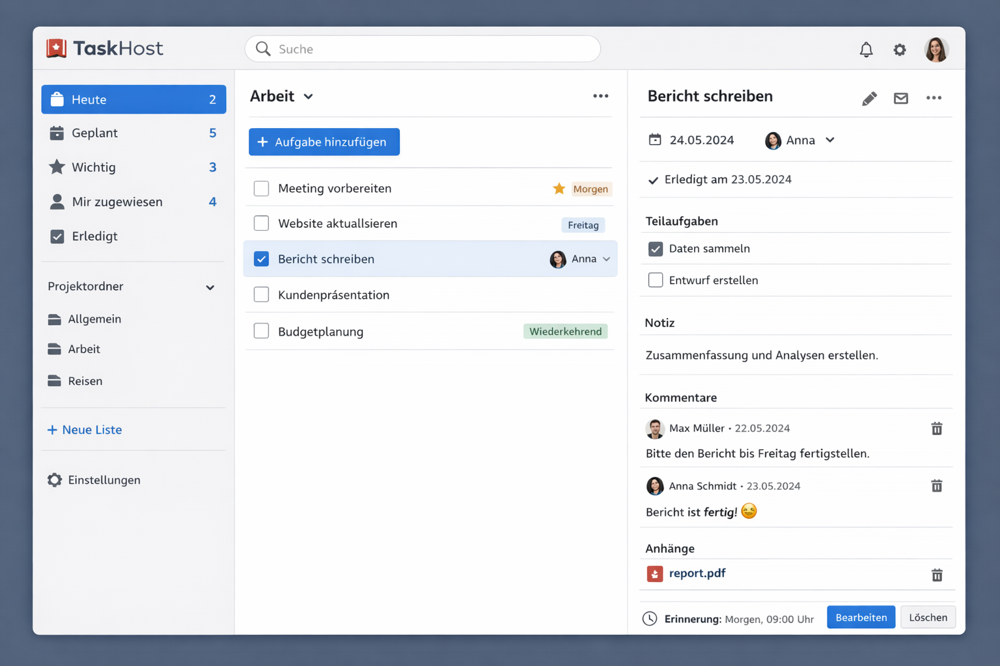

# TaskHost

TaskHost is a task, list, and project management application with a **PHP REST API backend** and a **modular JavaScript frontend**.

The repository is intentionally structured with separate **`api/`** and **`app/`** directories. This keeps backend and frontend concerns cleanly separated while still allowing both parts to evolve together in one repository.



## Current Status

TaskHost is in an **early but already usable development stage**.

The repository currently contains:
- a PHP REST API for authentication, folders, lists, tasks, subtasks, notes, comments, reminders, attachments, invitations, and smart views
- a JavaScript frontend with list, task, share, reminder, and search flows
- SQL migrations for MySQL and SQLite
- asynchronous mail outbox and queue infrastructure
- worker commands for reminder and mail processing
- a small installer/bootstrap script for easier local setup
- a first PHPUnit unit-test suite for core backend classes

This is **not yet a final production release**, but it already provides a solid architectural and functional base.

## Repository Structure

```text
.
├── api/
│   ├── bin/
│   ├── docs/
│   ├── migrations/
│   ├── public/
│   ├── src/
│   ├── storage/
│   ├── tests/
│   ├── .env.example
│   ├── composer.json
│   ├── phpunit.xml
│   └── README.md
├── app/
│   ├── assets/
│   ├── docs/
│   ├── src/
│   ├── index.html
│   ├── package.json
│   └── README.md
├── docs/
│   ├── images/
│   ├── README.DE.md
│   └── README.EN.md
└── README.md
```

## Architecture Overview

### Backend (`api/`)
The backend is implemented as a layered PHP REST API.

Main backend areas:
- `Controller/` for HTTP endpoint handling
- `Service/` for business logic
- `Repository/` for persistence logic
- `Security/` for authentication and token handling
- `Infrastructure/` for configuration, database, and mail concerns
- `bin/` for CLI tools such as install, doctor, migrate, seed, and worker commands

### Frontend (`app/`)
The frontend is a modular JavaScript application without a mandatory build step.

Main frontend areas:
- `src/app.js` for application orchestration
- `src/api/` for backend communication
- `src/ui/` for rendering and templates
- `src/utils/` for helpers such as date formatting
- `assets/` for styling and static assets

The separation between `api/` and `app/` is deliberate and should remain in place.

## Core Features

### Backend Features
- user registration, login, logout, and bearer-token authentication
- folders and task lists
- task creation, update, completion, starring, movement, and assignment
- subtasks
- notes and comments
- user-specific reminders
- attachments
- list sharing and invitations
- invitation resend flow
- smart views such as Today, Planned, Important, Assigned, and Completed
- SQL views for easier reporting and access queries
- async mail outbox and queue jobs

### Frontend Features
- authentication UI
- smart views
- folder and list management
- task detail panel
- subtasks, notes, comments, reminders, and attachments
- invitation handling and invitation resend
- async-aware reminder and mail feedback
- search

## Async Mail and Queue

TaskHost includes a first asynchronous processing layer for invitation mails and reminder delivery.

Included components:
- mail outbox storage
- queue job storage
- worker commands
- resend flow for invitations
- reminder enqueueing
- safe default mail transport for development

This allows mail-related operations to be handled more robustly than direct synchronous delivery inside HTTP requests.

## Installer

The backend includes a small installer/bootstrap script:

```bash
cd api
php bin/install.php
```

What it does:
- creates required storage directories
- optionally copies `.env.example` to `.env` if `.env` is missing
- validates core configuration values
- can run `doctor`, migrations, and seeding
- prints the next useful commands for local startup

Useful options:

```bash
php bin/install.php --help
php bin/install.php --migrate
php bin/install.php --migrate --seed
php bin/install.php --force-copy-env
```

The installer should be seen as a **local bootstrap helper**, not as a full deployment system.

## Testing

The repository now includes a first PHPUnit unit-test suite in `api/tests/`.

Current test focus:
- `PasswordHasher`
- `TokenService`
- `DateTimeHelper`
- `MailTemplateService`

Run the tests with:

```bash
cd api
composer install
composer test
```

Or directly:

```bash
vendor/bin/phpunit --configuration phpunit.xml
```

These tests are intentionally small and stable. They are meant to secure core helper and service behavior before broader integration and end-to-end tests are added.

## Getting Started

### Backend

```bash
cd api
composer install
cp .env.example .env
php bin/install.php --migrate
php -S 127.0.0.1:8080 -t public
```

Optional development data:

```bash
php bin/seed.php
```

### Frontend

Open a second terminal:

```bash
cd app
python3 -m http.server 4173
```

Then open:
- frontend: `http://127.0.0.1:4173`
- backend: `http://127.0.0.1:8080`

By default, the frontend points to `http://127.0.0.1:8080/api/v1` for local development.

## Worker Commands

Examples:

```bash
cd api
php bin/worker.php reminders:enqueue --limit=100
php bin/worker.php queue:drain --queue=mail --limit=50
php bin/worker.php queue:work --queue=mail --limit=50 --sleep=10
```

These commands are especially relevant for reminder mails and invitation delivery.

## Recommended Next Steps

Recommended next steps for the repository:
- expand backend unit tests
- add backend integration tests for repositories and selected API flows
- add frontend smoke tests
- improve deployment documentation
- add export/import
- add push notifications
- improve offline/sync strategy
- introduce OpenAPI or API reference documentation

## Why `app/` and `api/` stay separate

TaskHost deliberately keeps frontend and backend in separate directories.

Reasons:
- clearer responsibilities
- easier maintenance
- better test separation
- easier future deployment flexibility
- less accidental coupling between UI and backend internals

This is an intended architectural choice, not an unfinished intermediate state.

## Documentation

Additional documentation is available in:
- `docs/README.DE.md`
- `docs/README.EN.md`
- `api/docs/`
- `app/docs/`

